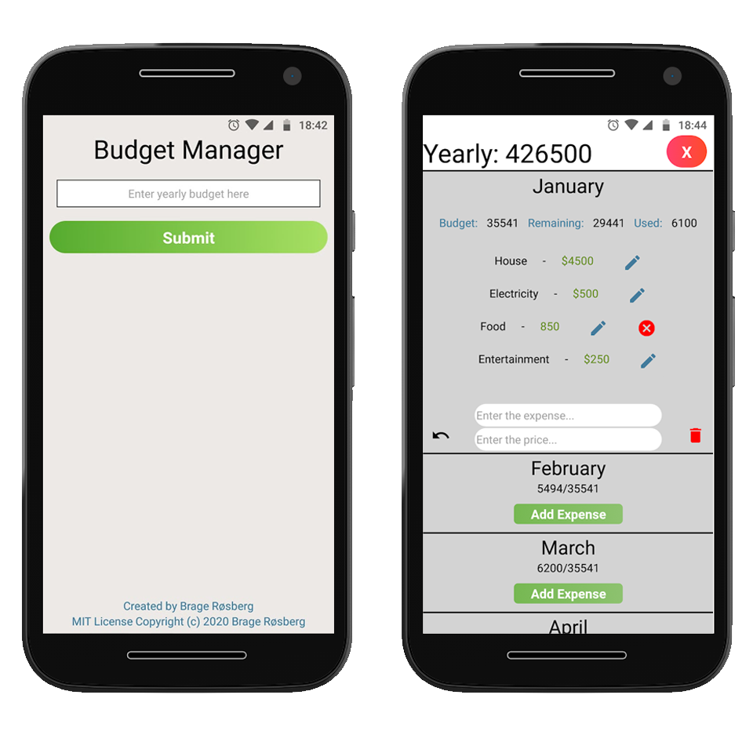

<p align="center">
  
</p>
# Budget Manager - Android
A convertion of my initial creation of this concept for [web availability][bmweb], developed through React Native with Expo client suited to work for Android.

## Test Locally
* Clone this repository
* Make sure the expo-CLI is installed: ```npm install expo-cli --global```
* ``` npm i "&&" expo start ```

# Article 
- [Contents of App](#contents)
- [Tech Usage and Reasoning](#tech-usage-and-reasoning)
- [Challenges Faced](#challenges-faced)
- [Design](#design)
- [Full Description](#full-description)
- [Get in touch!](#contact)

# Contents
Have control and organise your economy. Add a yearly budget and fill out expenses for each month. Displays how much is disposed per month, used and remaining. All values get stored so the numbers will be just like you expect them to be when you come back. App is uploaded to Google Play and currently undergoing review before launch. 

# Tech
Developed with the Expo client through React Native. AsyncStorage for saving budget and each individual expense is possible through a system from  the React Native Community.  

# Challenges Faced
This section will be filled out shortly.

# Design
This section will be filled out shortly.

# Full Description
This section will be filled out shortly.

# Contact:
[][linkedin]
[][website]
<a href="mailto:bragecontact@gmail.com"></a>

### Creator 
MIT License
Copyright (c) 2020 Brage Røsberg

 [linkedin]: https://www.linkedin.com/in/brage-rosberg/
 [website]: https://www.bragerosberg.com
 [bmweb]: https://github.com/bragerosberg/budget-manager
