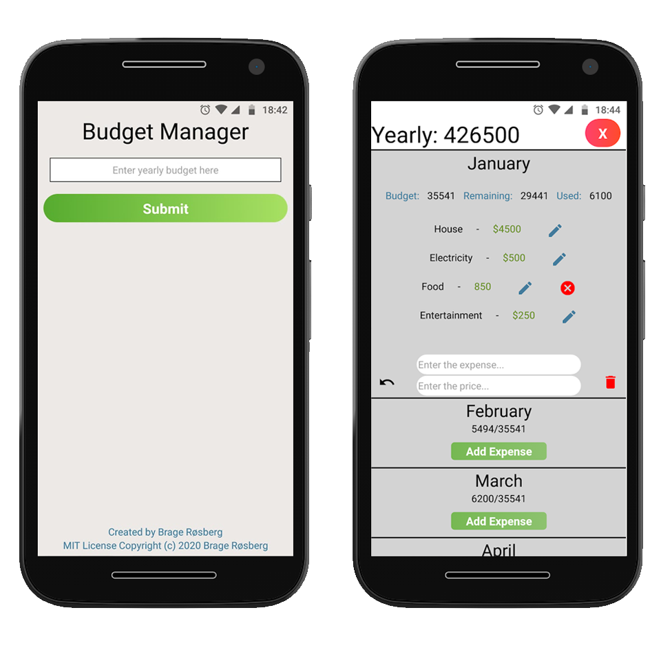

<p align="center">
  
</p>

## Try it out yourself
* Clone this repository
* Make sure the expo-CLI is installed: ```npm install expo-cli --global```
* ``` npm i "&&" expo start ```

## The App
Have control and organise your economy. Add a yearly budget and fill out expenses for each month. Displays how much is disposed per month, used and remaining. All values get stored so the numbers will be just like you expect them to be when you come back. App is uploaded to Google Play and currently undergoing review before launch. 

## Tech
Developed with the Expo client through React Native. AsyncStorage for saving budget and each individual expense is possible through a system from  the React Native Community.  

### Creator 
MIT License
Copyright (c) 2020 Brage Røsberg
